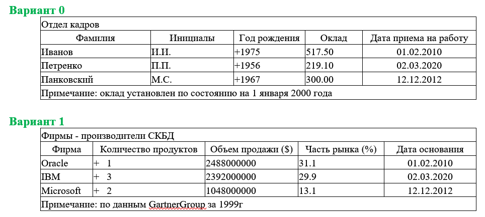

# [RU/РУ] ProgramsC

# Практические работы на языке С/C++.

### 1) Практическая работа №0
#### *Поточный ввод-вывод [ cin, getline(), cout, clear() ]
#### *Манипуляторы потока [ endl, width(), fill(), precision(), dec, hex, oct ] 

#### *Разработать программу, которая вводит фактические данные из таблицы, представленной в задании и выводит на экран таблицу, подобную той, которая находится в индивидуальном задании (включая заголовок и примечания)*

##### 2) Практическая работа №1
###### *
###### *
###### *
###### *
