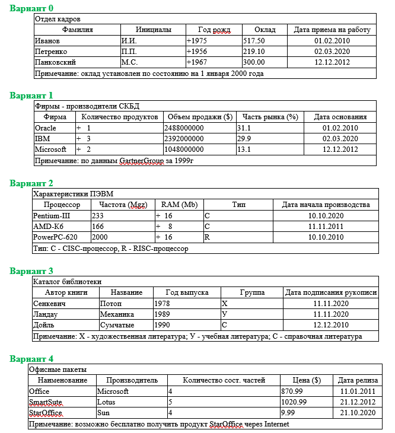

# [RU/РУ] ProgramsC

# Практические работы на языке С/C++.
---
### 1) Практическая работа №0
#### *Поточный ввод-вывод [ cin, getline(), cout, clear() ]
#### *Манипуляторы потока [ endl, width(), fill(), precision(), dec, hex, oct ]
#### *Структуры
#### *Передача структуры в функцию
#### *Операции над структурами
---
#### *Разработать программу, которая вводит фактические данные из таблицы, представленной в задании и выводит на экран таблицу, подобную той, которая находится в индивидуальном задании (включая заголовок и примечания)*

---
### 2) Практическая работа №1
#### *Массивы структур
#### *Операции над структурами
#### *Передача структуры в функцию
---
#### *Реализовать массив структуры Table[10], тип элементов которого описан в соответствии с табличными данными из варианта практической работы №0, и выполнить задание.*

---
### 3) Практическая работа №2
#### *Способы выделения памяти
#### *Место для выделения памяти
#### *Динамическое выделение памяти [ malloc(), calloc(), realloc(), free(), new, delete ]
#### *Функции memset(), memmove()
---
#### *Используя функцию malloc() / calloc() создать динамический массив A, элементами которого будут структура Record, созданная в практической работе №1. В массив А добавить столько соответствующих записей из массива Table[], сколько указано в качестве целочисленного значения поля (элемента структуры).*
#### *Используя функцию new создать массив В и скопировать 10 записей массива А. Остальные записи в массиве А удалить.*

#### *Вывести на экран адреса первого элемента массива Тable, массива А и массива В.*

#### *Вывести на экран в виде таблицы:*
#### *адрес А[i], значение A[i]->строковое_поле, адрес В[i], значение В[i]->строковое_поле.*
#### *Освободить память.*
---

### 4) Практическая работа №3
#### *Связный список
#### *Односвязный список
#### *Двусвязный список
---
#### *Реализовать динамический связный список, информационная часть которого представляет собой структуру Record, разработанную при выполнении практической работы №1. Создание списка (инициализацию значений элементов структуры) выполнить на основе данных массива Table, последовательно сохранив все элементы массива в списке 2 раза.*

#### *Вывести на экран значения полей элементов списка, включая значение головы списка (адрес первого элемента), адрес в памяти каждого элемента списка, значения информационной области, значение поля next (и поля prev –в случае двунаправленного списка).* 

#### *Выполнить задание варианта.*

#### *Повторно вывести значения элементов списка, как это описано выше.*

#### *Освободить выделенную память.*

---

